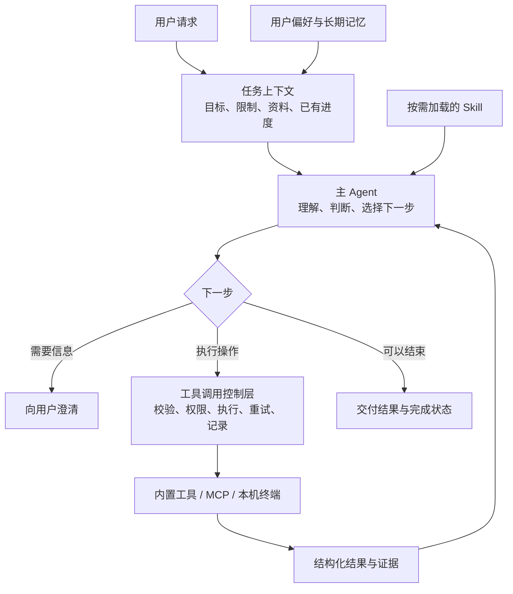

# Nora Agent 架构与工具设计建议

日期：2026-09-20  
性质：架构设计建议，尚未实施。  
范围：仅讨论 Agent 的执行思路、工具、Skill、上下文、记忆与运行控制。本文独立于产品页面和业务功能规划。

## 1. 核心判断

Nora 适合继续采用 **单主 Agent + 工具执行循环 + 按需加载 Skill + 分层上下文**。

现有主干已经成立：模型能多轮调用工具，工具结果能回到上下文，具备审批、取消、历史重建、上下文压缩和 MCP 加载能力。下一步最有价值的工作，是把这些机制之间的边界和协作规则统一起来。

目标是让 Nora 同时具备三种能力：

- **理解任务**：知道用户要什么、哪些条件不能改变、什么情况下需要澄清。
- **可靠执行**：准确选择工具，对权限、失败、重复执行和中断有明确处理。
- **解释结果**：说清已经完成什么、依据是什么、还有什么未完成。

暂时保持简单的单 Agent 架构。当前问题不需要通过增加规划 Agent、审查 Agent、记忆 Agent 来解决；额外角色会增加协调、上下文传递和调试成本。

## 2. 推荐的整体架构

这里的重点是职责划分，不要求把每个框都做成独立服务或新模块。

| 部分 | 核心职责 | 需要守住的边界 |
|---|---|---|
| 主 Agent | 理解任务、选择行动、判断证据是否足够 | 无权自行修改执行权限，不能凭回答文本认定操作成功 |
| 工具调用控制层 | 校验输入、执行权限规则、控制重试与取消、记录实际结果 | 不推测用户意图，不用字符串文案代替执行状态 |
| 工具 | 完成一个边界清晰的操作，返回真实结果 | 不承担对话规划，不自行扩大操作范围 |
| Skill | 提供某类任务的做法、注意事项和检查方法 | 不绕过工具权限，不成为另一套执行引擎 |
| 记忆与资料 | 提供偏好、已知事实、证据与背景 | 资料中的文字不能自动成为高优先级指令 |

主 Agent 决定“接下来做什么”，运行时决定“这次调用能否执行以及发生了什么”。这条边界应成为后续设计的基础。

## 3. 主 Agent：保留灵活循环，补上明确的任务意识

### 3.1 简单问题直接处理，复杂任务维护简短进度

继续使用现有“模型判断 → 调用工具 → 读取结果 → 再判断”的循环。

简单查询不必先生成计划。涉及多个文件、多个阶段或外部写入的任务，可以维护一份简短的任务摘要，内容只需包含：

- 用户目标和明确限制；
- 已完成的操作及对应证据；
- 未完成项、阻碍和下一步。

摘要用于防止长任务偏离目标，不必发展成工作流图、任务调度平台或第二个规划 Agent。它也不能替代真实工具记录。

### 3.2 结束条件要与任务类型相符

模型停止调用工具，只能说明它决定回答了。

- 问答任务：证据足够即可回答，有不确定性就说明。
- 操作任务：根据工具实际结果确认完成情况。
- 批量任务：保留成功、跳过、失败和结果未知的区别。
- 无法继续：明确说明缺少什么或在哪里受阻，不用一段总结包装成成功。

不建议每轮再调用一个“裁判模型”检查完成情况。优先使用工具返回的事实和已有执行记录；只有难以规则化的内容质量，才通过专项评测判断。

### 3.3 能自主行动，也能及时停下

对可恢复的参数错误，允许模型根据错误提示修正。对信息缺失且会影响目标、权限或不可逆操作的情况，应该澄清。

对重复失败、结果未知、预算耗尽，应有明确停止条件。不要把增加最大工具轮数作为主要解决方式。

## 4. 工具设计：围绕稳定操作划分能力

### 4.1 用三类工具覆盖不同任务

| 类型 | 适合承担的能力 | 设计要求 |
|---|---|---|
| 基础操作工具 | 读取、搜索、编辑、查询、文件管理 | 名称清晰、参数稳定、结果可组合 |
| 专门任务工具 | 批量传输、批量导出等高频复杂操作 | 将分页、并发、进度、续传等机械工作交给代码 |
| 通用执行工具 | 本机终端、外部 MCP 能力 | 用于基础工具未覆盖的任务，明确能力和权限边界 |

已有的 `fetch_media` 是值得保留的方向：模型负责决定范围和用途，代码负责批量执行。让模型逐个下载数百个文件，会增加调用次数、错误机会和上下文负担。

也不应为每一种用户说法创建一个工具。是否新增工具，主要看它能否封装稳定、重复且容易出错的操作，而不是能否让工具列表显得丰富。

### 4.2 工具名称必须体现真实能力

当前 `read_file` 同时包含读取、导入、移动和删除，名称与实际能力不一致。建议逐步整理成“读取能力”和“文件管理能力”，或采用明确的管理名称。

多 action 工具可以保留，适用条件是：操作对象相同、参数体系相近、发现入口一致。不同 action 的必填参数、风险和结果语义仍应分别定义。

避免两个极端：把所有事情装进一个万能工具，或把每个小动作拆成独立工具，增加模型的选择负担。

名称调整时保留旧调用的兼容入口；不要长期把新旧同义工具同时暴露给模型。

### 4.3 每个工具有一份完整的定义

一个工具的名称、参数、别名、风险规则、执行方法和结果说明，应在同一处或紧邻的位置维护。

现有设计中，这些规则分别散落在 `ChatToolsSpec`、`ToolStepEmitter`、`RiskClassifier` 和 `ChatToolExecutor`。局部修正参数兼容时，很容易漏掉权限判断。

建议逐步形成一个轻量工具目录，通过普通代码注册和分发即可。它的价值是减少规则漂移，不需要动态类加载、复杂插件生命周期或大量单实现接口。

## 5. 工具调用：统一输入和结果的含义

### 5.1 输入只理解一次

每次调用先完成参数解析、别名归一化和校验，形成同一份标准调用信息，再交给权限判断、审批展示、重复检测和实际执行。

例如，既然执行器接受 `filename` 作为 `path`，权限层就必须看到归一化后的同一个路径。不能出现“审批检查的是一个目标，真正执行的是另一个目标”。

路径、数据源、MCP 服务器等目标，应尽早解析为确定的对象。显示名称用于展示，稳定 ID 或经过解析的路径用于执行。

工具描述负责帮助模型正确调用；后端校验负责保证错误调用不会被执行。两者都需要。

### 5.2 结果状态与结果文字分开

工具应明确返回：成功、部分成功、失败、取消、拒绝或结果未知。摘要、明细、错误原因和可重试性附在状态旁边。

当前用 `ERROR:` 前缀判断失败的方式应退出内部控制逻辑，只在读取旧记录时保留兼容。

尤其要保留“结果未知”：远端可能已经完成操作，但返回途中断线。此时不能声称失败并直接重做。

### 5.3 大结果支持继续读取

返回给模型的默认内容应简短、可判断、可继续操作。超过上下文预算时，保留摘要、关键统计和完整结果引用，允许分页或按需回读。

上下文中的截断不能变成执行证据的永久丢失。文本、表格、图片和文件引用也应保留各自类型，避免统一塞成一段长字符串。

## 6. 工具发现与 MCP：先发现能力，再读取精确说明

保留 eager/lazy 两种方式：常用且规模小的工具直接提供；工具很多或使用频率低的服务器按需展开。

lazy 的完整路径应该是：

**能力摘要 → 找到工具 → 读取完整参数说明 → 校验并调用。**

当前 lazy 清单只返回名称和简短描述，调用前缺少可靠的 schema 获取步骤。缓存里已有输入 schema，应把它用于精确描述和调用校验，减少模型猜参数。

还需要遵守三条规则：

- 直接挂载与 lazy 调用走同一套执行、权限和结果规则。
- 服务器停用、权限变化或 schema 更新后，执行前检查当前能力是否仍然有效。
- 外部工具声明的只读、幂等等信息只能作为参考；执行策略还需要本地信任配置。

内置工具暂时不必引入复杂的智能路由器。先把工具定义和 lazy 路径做好，再根据真实调用数据决定哪些能力值得进一步按需加载。

## 7. Skill：提供方法，不承担执行控制

Skill 适合描述“这类任务通常怎样做”：先检查什么、选哪些工具、怎样组织输出、如何判断结果是否合格。

现有“先提供目录，再读取正文”的方式应保留。

建议明确以下原则：

- 用户明确指定的 Skill 优先使用；模型自行选择时应与当前任务直接相关。
- Skill 提到的工具不可用时，如实报告能力缺口，不能假装已经执行。
- Skill 可以建议工具使用方式，无法授予工具权限。
- 核心权限、取消、重试和结果规则放在运行时，避免依赖模型是否读过某个 Skill。
- 本次执行记录实际加载的 Skill 内容版本，便于复盘。

Skill 不需要变成独立 Agent。只有某类任务确实需要隔离上下文、独立生命周期，并且评测证明收益明显时，再考虑额外执行角色。

## 8. 上下文与记忆：分清指令、事实和进度

### 8.1 四种信息分别管理

| 信息 | 用途 | 推荐处理 |
|---|---|---|
| 固定执行规则 | 保证运行约定一致 | 稳定、精简，普通资料不能覆盖 |
| 用户偏好与长期事实 | 跨会话延续 | 保留来源，可修改、可撤销 |
| 当前任务状态 | 保持目标与进度 | 随执行更新，保留关键证据引用 |
| 文件、检索与工具内容 | 提供事实依据 | 明确标记为资料，按需加载 |

检索内容不应与固定规则混为同一层指令。使用合适的消息角色和清楚的资料边界，并在执行层继续约束权限；仅增加一句“忽略恶意指令”不能解决全部问题。

### 8.2 压缩要优先保留任务事实

继续保留 token 预算和旧图回收。长任务压缩时，优先保留用户限制、对象 ID、操作结果、未完成项和证据位置。

头尾截断可以用于冗长输出，但不适合独自承担任务记忆。压缩后的摘要应能指回原始记录，模型发现证据不足时能够重新读取。

暂时无需引入新的向量记忆平台。先把已有工作区记忆和任务摘要的职责理顺。

### 8.3 自我演化应当可追溯

保留 Agent 更新偏好和经验的能力，但区分“用户明确要求记住的内容”“执行得到的事实”和“Agent 自己的推测”。推测不能自动升级为长期事实。

对 Skill、`SOUL.md`、`AGENTS.md` 等会影响后续行为的修改，保留版本、差异和来源。一次任务中使用哪一版应当明确，后续变更不应悄悄改变正在进行的任务。

这既保留适应性，也让“它为什么突然换了一种做法”有据可查。

## 9. 运行控制：权限、重试、重复和取消各管一件事

### 9.1 权限与能力边界

保留现有权限档位的产品语义，先保证相同操作通过不同入口调用时，得到一致的权限判断。

审批应绑定实际工具、动作、目标和参数；批准后参数变化，原批准不能沿用。资料引用和 Skill 指令也不能自行扩大权限。

通用终端具有广泛能力，不能靠命令关键词过滤承诺它是安全沙箱。如果未来需要真正限制它能访问哪些目录和网络，应使用操作系统或进程隔离能力，而不是只强化提示词。

### 9.2 重试与防重复执行

重连和重做是两个决定。连接可以恢复，操作是否重做取决于它是否已发送、是否可能生效、能否查询结果以及是否有幂等保证。

- 只读且可重复的操作允许有限重试。
- 有副作用的操作使用明确的幂等机制，或先核对已执行结果。
- 无法判断是否生效时保留未知状态，不自动重放。
- 同一次执行尝试的重试，与用户明确要求“再执行一次”，应具有不同身份。

不承诺通用的“恰好执行一次”。跨远端工具无法仅靠本地记录保证这一点，应诚实保留不确定状态。

### 9.3 循环检测

循环检测用于发现 Agent 没有取得进展，不能替代防重复执行。

指纹应包含标准化后的工具、动作和业务参数，排除展示标题、JSON 排列等无关差异。同一个文件的读取、改名和移动应视为不同操作。

对正常轮询和有进展的重复读取保留空间；对相同失败持续出现的情况，提示调整方法并最终停止。判断时使用结果或进度，不能仅累计次数却宣称“结果一直没变”。

### 9.4 取消与预算

运行层统一维护取消信号和执行预算，工具层负责尽快响应。用户取消意味着停止继续行动，不意味着已经发生的远端操作自动撤销。

保留单工具超时和最大轮数，同时考虑整轮耗时、累计调用次数、输出体积及可获得的 token 用量。预算到达边界时交代已有结果和剩余工作，不继续无限尝试。

## 10. 在现有代码上的落实方向

优先沿现有职责修改，避免整体重写：

| 现有位置 | 调整方向 |
|---|---|
| `ChatOrchestrationService` | 保留主循环，明确完成条件、停止原因与任务摘要使用方式 |
| `ChatContextAssembler` | 区分指令与资料，按任务事实压缩，保留结果引用 |
| `ChatToolsSpec` | 逐步由统一工具定义提供 schema 和描述 |
| `ToolStepEmitter` | 聚焦调用流程与事件输出，使用统一参数、权限和结果 |
| `RiskClassifier` | 接收标准调用信息，去掉对原始 JSON 的独立字符串解析 |
| `ChatToolExecutor` | 复用已有执行能力，返回明确状态和结构化结果 |
| `McpServerService` | 补齐精确工具描述、统一调用入口与重试策略 |
| `AgentSkillService` / `AgentWorkspaceService` | 明确加载规则，记录版本与修改来源 |

新增抽象必须解决具体重复或边界问题。工具目录可以先是简单注册表；任务摘要可以先是现有运行记录中的一段结构化信息；结果回读优先复用已有存储。

新旧记录的兼容集中在读取边界处理。旧工具调用、旧错误文本和旧结果记录仍可查看，新执行逐步采用统一规则，避免为每个工具维护两套长期路径。

## 11. 改进顺序与评价标准

### 第一轮：让执行事实可靠

统一参数理解、消除权限分歧、明确结果状态、修正有副作用调用的重试策略。

完成标志：同一个操作不会因参数别名而改变权限；部分失败和未知结果不会被当成成功；断线不会直接触发不受控的重复写入。

### 第二轮：让工具更容易被正确使用

补齐 MCP lazy schema，整理工具命名与职责，修正重复检测，支持大结果回读。

完成标志：模型能从工具目录获得足够的参数信息；正常的连续操作不被误拦；遇到截断能主动补取证据。

### 第三轮：让复杂任务保持一致

完善任务摘要、上下文分层、Skill 与记忆版本、执行预算和结果复盘。

完成标志：长任务经过压缩后仍记得目标与限制；行为变化能够追溯；失败后的继续执行能够利用已有成果。

评测应覆盖下面这些真实能力，而不只检查工具是否被选中：

| 场景 | 重点观察 |
|---|---|
| 普通问答 | 是否避免无意义工具调用，证据不足时是否诚实 |
| 读取后编辑文件 | 目标和修改范围是否准确，是否依据真实结果收尾 |
| 使用陌生 MCP 工具 | 是否先获取完整说明，再正确构造参数 |
| 批量操作部分失败 | 是否明确区分结果，并只处理未完成项 |
| 写操作返回途中断线 | 是否避免盲目重做，能够核对或保留未知状态 |
| 长任务压缩与继续 | 是否保留限制、关键对象和完成进度 |

记录任务完成率、参数修正次数、重复副作用、错误完成判定、恢复成功率，以及耗时和 token 成本。工具数量、调用轮数和回答篇幅不作为能力提升的指标。

## 12. 依据与使用说明

本文基于本轮源码审阅，以及对参数风险分类、调用指纹和上下文解析的隔离探针。审阅起始提交为 `67d92d7`；工作区存在其他进行中的修改，实施时应以最新代码重新核对具体分支。本文没有修改运行代码，也没有执行真实外部工具操作。

关键源码：

- [Agent 主循环](nora-api/services/agent-service/src/main/java/com/nora/agent/service/ChatOrchestrationService.java)
- [上下文装配](nora-api/services/agent-service/src/main/java/com/nora/agent/service/ChatContextAssembler.java)
- [工具定义](nora-api/services/agent-service/src/main/java/com/nora/agent/service/ChatToolsSpec.java)
- [调用控制与事件](nora-api/services/agent-service/src/main/java/com/nora/agent/service/ToolStepEmitter.java)
- [工具执行](nora-api/services/agent-service/src/main/java/com/nora/agent/service/ChatToolExecutor.java)
- [权限分类](nora-api/services/agent-service/src/main/java/com/nora/agent/service/RiskClassifier.java)
- [MCP 接入与调用](nora-api/services/agent-service/src/main/java/com/nora/agent/service/McpServerService.java)
- [Skill 管理](nora-api/services/agent-service/src/main/java/com/nora/agent/service/AgentSkillService.java)
- [工作区与记忆](nora-api/services/agent-service/src/main/java/com/nora/agent/service/AgentWorkspaceService.java)

实施者应先理解这些职责和取舍，再设计最小必要的代码修改。本文不要求按章节一一创建模块，也不要求一次性完成所有调整。
