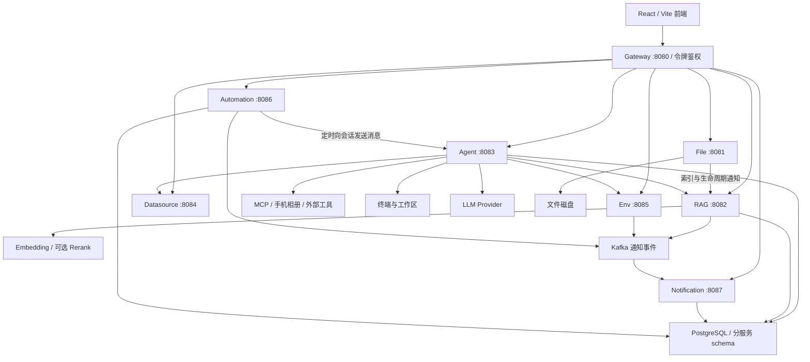

**Nora 项目分析（2026-09-26）**

Nora 已形成有实际实现支撑的个人 AI 助手：资料导入与检索、对话执行工具、保存成果、定期再次执行，能够组成一条完整产品链路。工程基础也比 09-19 的分析明显改善，当前前后端检查全部通过。下一阶段最值得投入的是执行状态和数据一致性：本次确认了三个能够让“页面显示的事实”偏离“系统实际发生的事”的问题。

当前适合继续按单用户、单 Agent 实例运营和打磨。代码规模、基础设施数量及工具权限已经超过普通聊天应用；多人权限隔离、跨实例运行恢复和可靠任务投递并未因为采用微服务而自动具备。

本次基于工作区 HEAD `3b2207f` 及已有未提交改动分析。覆盖主仓库前端、后端、SQL 迁移、启动部署和评测脚本；对独立嵌套仓库 phone-album-mcp 只检查了架构文档及中继缓存鉴权路径，没有做 Android 全量审查、APK 构建或手机实测。没有修改业务代码、业务数据、部署配置或调用真实模型。新增文件仅为本报告，原有 `useKnowledgeDocs.ts` 改动保留。

知识图谱用于定位和梳理结构，引用路径另做覆盖检查。索引记录时间为 2026-09-26，覆盖检查对多处路径报告 `metadata_changed`，部分 SQL/TSX 存在解析缺口，相册仓库被排除；关键判断已回读当前源码，不能把图谱的“无结果”当作代码不存在的证明。本报告是核心链路的深入审查，不是逐行穷尽审计。

**产品价值主要来自四个环节能够连续工作。**

| 环节 | 当前实现 | 判断 |
|---|---|---|
| 输入需求 | 助手首页、会话、资料引用、模型选择 | 产品入口已经从技术模块收敛为任务入口 |
| 使用资料 | 文件管理、Tika 提取、资料库、分段、混合检索、引用 | 具备实际 RAG 数据链路，最近的更新集中在这里 |
| 执行动作 | 数据源、终端、工作区、环境控制、MCP、技能、媒体 | 是项目区别于普通知识库问答的主要价值，也扩大了权限和故障范围 |
| 留存和重复 | 会话/步骤/运行记录、成果保存、定期任务、通知 | 基本结构完整，但成功、失败和中断的统一口径仍需修复 |

主导航“助手 / 资料 / 任务 / 设置”是合理的。文件、知识、工作区成果、缓存媒体仍有多种存储身份；继续优化时应让用户看得清“原文件是什么、AI 使用哪个版本、成果保存在哪里”，优先解决这些具体语义，不必再增加一级技术入口。

**整体架构是一个 SPA，加八个服务和共享基础设施。**



图中省略部分数据库连接、Redis 和 Nacos，避免把业务链路淹没。Gateway 使用 `lb://` 和 Nacos 路由；已检查的内部调用还大量使用可配置的 `localhost:808x` HTTP 地址。因此它更接近“同机部署、按领域分进程”的个人系统，不宜把它当成已具备透明横向扩展能力的分布式平台。

| 范围 | 技术与规模 |
|---|---|
| 前端 | React 18、TypeScript、React Router 7、Vite、Tailwind、Radix、Zustand；本次实际构建 Vite 7.3.6 |
| 后端 | Java 21、Spring Boot 3.3.4、Spring Cloud、JdbcTemplate、Flyway；实际 Maven reactor 为 14 模块，其中 8 个服务 |
| 数据 | PostgreSQL 16 + pgvector；Redis 用于缓存/审批；Kafka 用于通知；文件和 Agent 工作区落磁盘 |
| 前端源码 | Git 跟踪的 `src/**/*.ts(x)` 共 194 文件、26,132 行，包含测试 |
| Java 主源码 | 154 文件、31,453 行 |
| Java 测试 | 34 文件、4,642 行 |
| SQL | 65 文件、1,492 行 |

行数包含注释和空行，不代表有效业务代码量；不含相册独立仓库、依赖和生成产物。

对个人场景，八个 JVM 进程加数据库、Redis、Nacos、Kafka 的运维成本偏高。领域划分有价值，尤其是 Agent、文件解析和环境控制具有不同故障特征；当前没有必要为降低进程数立即大合并，也不宜再增加基础组件。后续新增功能优先放回已有领域，部署参数和检查命令收敛成一套。

**核心实现中，有几处值得保留。**

- 前端已有路由懒加载、错误边界、统一 API 错误信封、请求缓存及失效版本守卫。页面能构建和回退的基础设施较完整。入口见 [App.tsx](D:/claude/Nora/nora-web/src/App.tsx:17) 和 [client.ts](D:/claude/Nora/nora-web/src/lib/api/client.ts:187)。
- Agent 链路已分为入口、轮次收尾、上下文组装、模型调用、工具执行与步骤输出。用户引用、检索、长期记忆、技能和工作区上下文都有实际接线；单会话并发入口使用原子占位，SSE 有滚动事件缓冲和缺口标记。
- MCP 已区分“连接未建立”和“调用发出后结果未知”。后者默认不自动重放，有本地信任配置且远端声明只读才允许重试。这比对所有网络异常直接重试可靠。见 [McpServerService.java](D:/claude/Nora/nora-api/services/agent-service/src/main/java/com/nora/agent/service/McpServerService.java:335)。
- RAG 已采用“构建新版本，再短事务发布”的方式；正文块先保存，Embedding 在事务外执行，失败信息可以持久化，旧的已发布版本能够继续参与检索。见 [IndexingService.java](D:/claude/Nora/nora-api/services/rag-service/src/main/java/com/nora/rag/service/IndexingService.java:101)。
- 检索分别记录向量和关键词通道状态，支持 RRF、范围过滤、父子分段和可选重排；Embedding 不可用时仍尝试关键词通道。`pg_trgm` 仍是三元组相似检索，不能等同于完整中文分词检索。见 [RetrievalService.java](D:/claude/Nora/nora-api/services/rag-service/src/main/java/com/nora/rag/service/RetrievalService.java:329)。
- 数据源只读路径已使用数据库连接级只读约束，而不是仅依赖 SQL 字符串检查；文件写盘后数据库插入失败也有清理孤儿文件的处理。
- 定期任务已经复用普通会话端点，而不是维护另一套 Agent 引擎。方向正确，下面的问题集中在结果消费和持久化语义，不需要重新设计整套定时任务。

**本次应优先处理的问题如下。P1 表示优先修复，P2 表示随后补齐。**

| 编号 | 优先级 | 问题 | 证据强度 |
|---|---|---|---|
| F1 | P1 | 文件生命周期通知可能倒退，并丢掉较新状态的重试记录 | 当前源码 + 真实方法隔离复现 |
| F2 | P1 | 定期任务把部分输出后的错误、无终态流和取消判为成功 | 当前源码 + 本地 HTTP/SSE 隔离复现 |
| F3 | P1 | 对话异常未参与最终运行状态判定 | 当前源码 + 真实轮次收尾方法隔离复现 |
| F4 | P2 | 工具评测在同时出现 error/done 时优先认定正常完成 | 当前脚本与 F3 实际事件序列交叉核对 |
| F5 | P2 / 在制功能 | 文件索引的资料库和分段参数只扩展了前端 hook，后端未接通 | 当前源码及已有未提交 diff |

F1 的根因是持久化边界不完整。[FileController.java](D:/claude/Nora/nora-api/services/file-service/src/main/java/com/nora/file/controller/FileController.java:79) 先改变文件状态，再调用 `@Async notifyLifecycleAsync`。版本分配、待发送记录更新也没有和文件变更处于同一事务；[RagIndexClient.java](D:/claude/Nora/nora-api/services/file-service/src/main/java/com/nora/file/client/RagIndexClient.java:102) 的 upsert 无条件覆盖现有 `version`，没有防止低版本覆盖高版本。

隔离复现使用真实 `RagIndexClient`、受控 JDBC 边界和本地 HTTP 端点，安排如下顺序：旧删除已取得 v1，但尚未入队；新恢复取得 v2、入队，发送遇到 503；旧删除随后把待发送行覆盖成 v1，发送成功并清掉待发送行。观察结果：

```text
pending=restore, version=2
pending=soft, version=1
finalPending=null
delivered=soft, version=1
latest-file-state=present
```

恢复通知永久丢失；反过来的动作顺序还可能让已删除文件重新参与检索。这是隔离调度复现，不是生产 PostgreSQL 上的事故证明。另外，文件变更后、异步入队前进程退出，也存在通知未落库的窗口。

最小完整修复是把文件变更、版本推进和待发送记录写入放进同一数据库事务，HTTP 投递留在事务外；upsert 再增加版本单调条件。只加重试次数或只换队列中间件都不能修复这个提交边界。

F2 位于 [ActionExecutor.java](D:/claude/Nora/nora-api/services/automation-service/src/main/java/com/nora/automation/service/ActionExecutor.java:143)。解析只累加 `delta`，仅在“有 error 且没有任何回答文本”时失败；没有要求收到正常终态，也不处理 `done.stopped` 和步骤失败。随后 [AutomationService.java](D:/claude/Nora/nora-api/services/automation-service/src/main/java/com/nora/automation/service/AutomationService.java:241) 用 `!detail.startsWith("ERROR")` 决定执行记录和成功通知。

本地测试 HTTP 端点向真实执行器分别发送四种流，实际结果如下：

| 输入流 | 当前判定 |
|---|---|
| 部分 delta → error | success |
| 部分 delta → EOF，没有 done | success |
| 部分 delta → done(stopped=true) | success |
| delta → 正常 done | success |

因此“有文字”被错误地用作“任务完成”的证据。建议复用会话持久化的运行状态和 runId，或让已有终态事件携带同源状态；执行器返回结果对象，保留正文与状态两个字段。错误、取消、未知结果和部分成功不应再由自然语言前缀推断。

F3 位于 [ChatTurnRunner.java](D:/claude/Nora/nora-api/services/agent-service/src/main/java/com/nora/agent/controller/ChatTurnRunner.java:286)。`whenComplete` 收到异常会发 `error`，但仍继续发 `done`；第 369 行只根据用户取消和步骤是否失败决定 `cancelled / partial / completed`，没有检查 `error`。

隔离调用真实收尾方法，替换模型和存储边界后观察到：

```text
异常 future，没有失败步骤 -> error + done，finishRun(completed)
异常 future，包含失败步骤 -> error + done，finishRun(partial)
```

第二种贴近当前模型最终失败路径：编排器先产生 `s-error`，再返回 failed future。即使没有可用成果，也会标成 partial。第一种展示的是收尾方法本身的错误契约，并不表示所有当前上游异常都会产生 completed。建议先确定唯一终态：真正异常且没有可用成果为 failed；partial 必须有实际完成部分；取消单独处理。SSE、数据库、任务列表和通知共用这一结果。

F4 位于 [tool-eval.sh](D:/claude/Nora/scripts/tool-eval.sh:70)。脚本已经修复忽略 curl 失败和空流的问题，这是进步；但 `if has_done ... elif has_error` 仍让 error+done 被视为正常。F3 正好会产生该组合。工具选择满足条件时，模型最后失败也可能被计为 PASS。应先验证业务终态，再检查工具选择，保留“运行失败”和“工具选择失败”两个原因。

F5 是当前在制功能的边界，不应冒充已经发布的 UI 故障。已有未提交 [useKnowledgeDocs.ts](D:/claude/Nora/nora-web/src/hooks/useKnowledgeDocs.ts:55) 开始发送 `baseId / chunkMode / chunkSize / overlap / separator`；但后端 [RagController.java](D:/claude/Nora/nora-api/services/rag-service/src/main/java/com/nora/rag/controller/RagController.java:641) 的文件 `IndexRequest` 只有 `fileId / name`，第 127 行也调用默认参数索引入口。已核对的 UI 调用方仍只传文件 id 和名称。文本索引接口已经支持这些参数，文件接口尚未对齐。

这意味着当前改动没有完成“文件按指定分段方式进入指定库”的闭环，类型检查通过无法发现这个跨语言契约缺口。补齐时应验证请求参数、持久化的分段配置和最终 baseId，而不是只看接口返回 200。

**部署安全需要按现有高权限能力来定边界。**

网关令牌是整个个人工作台的访问门，不是多用户授权体系。终端、工作区、数据库写入、容器控制和 MCP STDIO 都会触达宿主机或外部系统。工具审批属于 Agent 调用流程，不能代替各 HTTP 服务的网络边界。

[AuthGatewayFilter.java](D:/claude/Nora/nora-api/services/gateway-service/src/main/java/com/nora/gateway/auth/AuthGatewayFilter.java:43) 在令牌为空时允许访问。仓库服务配置仅指定端口，没有绑定回环地址；[部署脚本](D:/claude/Nora/scripts/deploy-megumin.sh:64) 生成的系统级 unit 未指定运行用户，也没有主动收窄子服务监听面；基础设施映射端口同样没有限定 `127.0.0.1`。Nginx 有 HTTPS 和访问控制，但不能保护绕过 Nginx 的直连端口。

这是源码和默认部署方式支持的条件风险。本次没有连接远端服务器，不能据此声称当前公网已经开放这些端口。建议在发布前验证真实监听和防火墙；同机内部服务优先只允许本机访问，外部统一走入口，普通 Agent 与需要宿主机特权的环境操作按实际需要分离。继续保留用户已选择的无人值守执行语义，不把安全建议变成额外的全局审批流程。

多实例也有明确限制：活动轮次、实时事件缓冲和部分防重状态在内存；启动恢复会将数据库里未结束的 run 标记为 interrupted，见 [ChatStoreService.java](D:/claude/Nora/nora-api/services/agent-service/src/main/java/com/nora/agent/service/ChatStoreService.java:387)。这能找回历史和解释中断，不能让进程重启后接着执行原工具。第二个 Agent 实例启动还会影响共享库中的活动状态，因此当前应维持单 Agent 实例假设。

**性能方面，首屏包体已有明显改善，接下来应关注真实数据规模。**

本次构建主入口 JS 为 302.84 KB、gzip 99.58 KB，低于维护规范的 180 KB 目标。09-19 报告中的 gzip 240.31 KB 和 Lint 故障已经不再成立。这里的 99.58 KB 仅指主入口 JS，不是整个首屏或全部页面的网络传输量；构建仍有一个 `useChatSessions` 同时被静态和动态导入的分块警告，但不影响构建。

已确认的规模限制包括：文件上传先把整体内容读成 byte[]，见 [FileStorageService.java](D:/claude/Nora/nora-api/services/file-service/src/main/java/com/nora/file/service/FileStorageService.java:71)；会话读取把消息及步骤整体加载，再做内存处理，见 [ChatStoreService.java](D:/claude/Nora/nora-api/services/agent-service/src/main/java/com/nora/agent/service/ChatStoreService.java:155)。文件 raw HTTP 控制器已使用文件资源路径，本报告不把未见调用的 `raw()` 字节数组方法当作当前下载链路瓶颈。

自动任务扫描还同步等待每个任务执行结束，再处理下一个，扫描采用 fixedDelay，见 [AutomationConfig.java](D:/claude/Nora/nora-api/services/automation-service/src/main/java/com/nora/automation/config/AutomationConfig.java:64) 和 [AutomationService.java](D:/claude/Nora/nora-api/services/automation-service/src/main/java/com/nora/automation/service/AutomationService.java:296)。当多个长任务在相近时间到期时，后续任务可能因前面的执行占用而超过 10 分钟宽限。这是任务数增长前应验证的容量边界，不是本次在线负载测试结果。

先以真实长会话、批量照片、大文件和多个同点计划建立耗时与内存基线，再决定分页、流式上传和独立调度执行的范围。现有 PostgreSQL + pgvector 没有在本次发现必须替换的证据，也没有必要增加新的执行预算机制。

**维护成本主要集中在少数大文件和重复表达的业务语义。**

| 文件 | 当前总行数 | 维护关注点 |
|---|---:|---|
| ChatToolExecutor.java | 1,955 | 多种工具领域聚集在一个执行器 |
| AgentWorkspaceService.java | 1,134 | 文件操作、路径和工作区策略集中 |
| ChatOrchestrationService.java | 1,094 | 上下文、模型轮次、重试和最终回答互相牵动 |
| files/page.tsx | 755 | 显著超过页面仅作胶水层的约定 |
| DocumentLibrary.tsx | 716 | 文档、分段、移动与配置交互集中 |
| useChat.ts | 581 | 流式状态、恢复、消息和会话行为集中 |

行数本身不是缺陷，也不建议一次性机械拆文件。先修状态契约和事务边界，随后在修改相关功能时按既有文件、媒体、MCP、任务领域提取职责。不要为了缩短文件引入通用插件框架或另一套 Agent 抽象。

文档仍存在漂移：后端 README 的“16 模块 / 106 测试”和当前 14 模块 / 272 测试不同；README 的检索阈值仍有 0.45 描述，当前配置默认值是 0.51；维护技能还保留早期纯前端说明；相册 README 开头写服务端零存储，后文已说明中继存在 TTL 磁盘缓存。应把 README 的当前事实收敛到一处，历史验收保留日期和当时环境。

**本次验证结果与边界如下。**

| 检查 | 结果 | 能支持的结论 |
|---|---|---|
| pnpm typecheck | 通过 | 当前前端类型可检查 |
| pnpm lint | 通过 | 当前前端 Lint 门禁通过 |
| pnpm test | 24 文件、126 测试通过 | 现有前端冒烟路径执行成功 |
| pnpm build | 通过，主入口 gzip 99.58 KB | 当前前端可构建；仍有一条分块警告 |
| mvn -B test | 14 模块成功；34 套件、272 测试；0 失败/错误/跳过 | 当前 Java 编译和现有测试通过 |
| 自动任务 SSE 隔离诊断 | 三类异常情形都被判为 success | F2 可确定性复现 |
| 轮次终态隔离诊断 | 异常映射 completed 或 partial | F3 可确定性复现 |
| 生命周期交错隔离诊断 | v1 覆盖 v2，较新待投递状态丢失 | F1 方法层并发缺陷可确定性复现 |
| 本机端口检查 | 3001、8080–8087 均无监听 | 本次没有进行真实服务全流程或浏览器在线验收 |

隔离诊断运行当前已编译的真实类，替换模型/存储边界或使用本地受控 HTTP 端点；不等于真实数据库、真实上游和浏览器的全链路验证。临时诊断文件位于 `C:/Users/24883/AppData/Local/Temp/nora-review-20260926`，没有加入产品或测试套件。

遵照项目约定，单测作为冒烟，不通过增加单元断言改变测试政策。要防止上述问题回归，应把明确的结果校验放到真实服务 E2E：失败必须对应正确运行终态；取消不能发成功通知；文件删除/恢复在 RAG 短暂不可用和请求交错后仍收敛；文件索引参数实际进入数据库配置。

仓库已有工具选择评测和固定语料 RAG 评测脚本，但本次未运行涉及真实模型/Embedding 的评测，因此没有报告新的召回率、答案正确率或线上延迟。主仓库跟踪文件未见 GitHub Actions、GitLab CI 或 Jenkins 工作流定义，不排除仓库外有流水线。数据、文件、工作区和配置的备份恢复也未在本次演练。

**建议按以下顺序推进，每一步都能独立验收。**

1. 先修 F1，保证文件变更与待发送状态原子提交，并用真实 PostgreSQL E2E 覆盖乱序和进程中断窗口。
2. 一起修 F2/F3，统一对话、定期任务、运行记录和通知的结果状态；顺手修 F4，让错误不再被评测脚本掩盖。
3. 完成当前 F5 的文件索引参数接线，验证配置、资料库与实际分段一致，再补充用户可见配置入口。
4. 核查真实部署监听面、服务身份和恢复流程；用当前构建检查加关键 E2E 形成可重复发布检查。
5. 随业务改动逐步整理大文件；达到实际数据量瓶颈后再做性能和调度并发改造。

目前已有功能组合足以继续形成有价值的个人助手。下一轮的交付标准应聚焦可观察事实：完成有成果，失败有明确终态，取消不会被当成成功，资料状态在故障和重试后仍一致。
