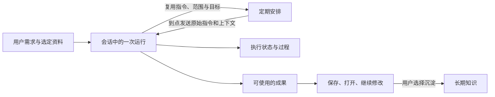

# Nora 产品、业务与架构设计分析

评审日期：2026-09-26～27。代码基线：`436b850`。范围：主仓库的前后端、产品设计文档及本机会话中的页面观察。

## 1. 总体判断

Nora 已经具备个人 AI 助手需要的主要执行能力：使用资料、操作工具、保留会话、生成文件、按日程重复处理。当前最值得投入的是让这些能力围绕同一件事连续工作：用户交代的对象不丢失，处理结果有明确去向，成功经验可以准确复用。

**我的判断：功能建设已经走在产品语义前面。** “成果”“任务”“资料范围”“完成”等概念在不同页面和服务里仍有不同含义，这会让用户付出额外的核对成本。下一轮应优先统一这些含义和交接数据。

| 维度 | 判断 | 主要依据 |
|---|---|---|
| 产品定位 | 适合技术型个人用户的自部署助手 | 数据源、环境、终端、MCP 与文件处理都有实际作用 |
| 业务流程 | 主要环节存在，跨环节交接有缺口 | 保存成果、转为定期任务、指定资料范围的实现不完全符合页面含义 |
| 信息架构 | 主要入口清楚，子页面仍暴露较多存储与技术概念 | 资料下并存文件中心、工作区、媒体缓存、知识库；成果又来自执行记录 |
| Agent 设计 | 同一执行引擎被会话和定时消息复用，方向合理 | 自动任务直接调用正常会话端点 |
| 知识库 | 底层能力较完整，对话中的范围控制接线不足 | 检索 API 支持范围；普通对话自动检索只传 query/topK |
| 可靠性 | 最近修复改善了事务和运行终态，页面表达仍有遗漏 | 文件生命周期同事务入队；done.status 与运行状态同源；成果页仍二分成功/失败 |
| 技术架构 | 领域分工有价值，个人部署成本偏高 | 八个 Spring 服务及多种基础设施；前端仍把 Agent 健康当成全站可用性 |

这是一份设计评审。代码事实、页面观察和后续建议在下文分别说明；没有把建议描述为现有功能。

## 2. 产品定位：优先服务什么人、什么事

当前最契合的用户画像是：有自己的文件、数据库或服务，愿意自部署，希望 AI 能直接完成实际工作的个人用户。数据源和环境入口被保留在主导航，是已有用户选择，适合这一画像。

建议用一句话统一产品表达：

> Nora 使用我的资料和工具，完成具体工作，保存可继续使用的成果，并按安排重复执行。

这一定位可以覆盖三个稳定场景：

| 场景 | 用户实际要解决的事 | 交付应如何判断 |
|---|---|---|
| 资料分析 | 比较几份文件，提取差异与结论 | 报告有来源，能够保存、找回和继续修改 |
| 文件与照片整理 | 从来源中筛选一批内容并归档 | 对象集合、目标目录、成功/失败项可核对 |
| 数据与环境工作 | 查询、巡检、分析异常，周期性产出报告 | 执行目标准确，结果可查看，异常有下一步 |

三类场景可以共用“需求—资料—执行—成果—复用”。不必为每个场景再建立独立 Agent、独立任务引擎或一套新的页面体系。

产品是否值得继续扩展，应看这些场景是否被持续使用。个人项目可以先记录每周真正完成了哪些事、重复说明了几次上下文、找成果花了多久。仓库证据不足以推断市场规模、付费意愿或商业竞争力；这些需要真实用户反馈。

## 3. 值得保留的设计

### 3.1 会话承载执行，定时器复用会话

自动任务调用正常的 `/sessions/{id}/messages`，复用步骤、回答、审批语义和运行记录。用户还能在规则专属会话中查看处理过程。这个设计减少了两套 Agent 行为逐渐分叉的问题。

依据：[ActionExecutor.java](../../nora-api/services/automation-service/src/main/java/com/nora/automation/service/ActionExecutor.java:130)。应继续保持“定时发消息”的既有语义，改进输入和结果关联即可。

### 3.2 引用使用稳定 ID，结果使用原生组件

跨页交接已经有 refs，文件、知识文档、技能和 MCP 都有可识别对象。`nora-artifacts` 让模型提供结构化结果，再由前端画廊展示，能复用灯箱、文件打开和统一样式。

这些基础足以继续建设成果入口。成果正文和文件内容继续使用现有存储，只需补足来源与定位关系。

### 3.3 资料可用性与故障已有明确处理

RAG 采用先构建再发布，失败时保留旧的已发布版本；向量与关键词通道状态分开。文件删除/恢复与 RAG 待投递状态已放进同一事务。它们解决的是实际业务问题：新版构建失败不应让旧资料消失，跨服务短暂失败不应永久丢失资料状态。

依据：[IndexingService.java](../../nora-api/services/rag-service/src/main/java/com/nora/rag/service/IndexingService.java:102)、[FileLifecycleService.java](../../nora-api/services/file-service/src/main/java/com/nora/file/service/FileLifecycleService.java:53)。

### 3.4 用户保有过程与动作控制

工具步骤、取消、权限档位、连接启停、技能内容可查看，符合技术型个人用户的需求。已有无人值守执行方式和不增加执行预算的用户选择应继续保留。接下来主要需要把范围、执行结果和可恢复位置表达清楚。

## 4. 核心业务对象应怎样对应

目前代码中已有会话、消息、chat_run、automation_rule、execution_record、文件、知识文档和工作区路径。建议先明确它们各自回答什么问题：

| 概念 | 回答的问题 | 数据责任 |
|---|---|---|
| 会话 | 我们在持续讨论什么？ | 对话上下文与消息 |
| 一次运行 | 刚才那次请求执行得怎样？ | 输入、时间、步骤、终态、结果引用 |
| 定期安排 | 以后何时发出什么请求？ | 指令、日程、资料范围、目标和关联会话 |
| 资料 | 本次依据哪些内容？ | 原始对象、版本/更新时间、可用性 |
| 成果 | 哪个结果可以拿来使用？ | 名称、类型、现有存储位置、来源运行 |
| 技能与连接 | 按什么方法做、能使用什么工具？ | 方法说明与外部能力配置 |

推荐的关系如下，图中表示业务责任，不要求新增对应的服务：

**运行结束、产生回答、保存文件、用户得到所需成果，是四种不同事实。** 各页面应明确展示自己表达的是哪一种。

## 5. 已确认的主要设计问题

### B1 · 优先：成果入口和实际保存行为没有对齐

当前源码与页面观察一致：

- 首页 `RecentResults` 读取最近 5 条自动任务执行记录。
- 资料页 `SavedResultsView` 读取最近 50 条自动任务执行记录。
- 取消、结果未知、失败和错过计划的记录也会进入列表。
- 普通对话“保存为文件”写到工作区 `reports/...md`；按钮保存状态记在浏览器 localStorage。
- 普通对话“保存到知识库”通过文本索引接口进入知识库。

因此，用户保存的报告不由“已保存成果”列表统一呈现，而未产生可用成果的执行也会出现在这里。9 月 26 日页面观察中，“已保存成果”确实包含“错过计划点”的记录。

依据：[RecentResults.tsx](../../nora-web/src/components/home/RecentResults.tsx:19)、[SavedResultsView.tsx](../../nora-web/src/components/files/SavedResultsView.tsx:19)、[ChatMessageItem.tsx](../../nora-web/src/components/chat/ChatMessageItem.tsx:159)、[saveState.ts](../../nora-web/src/lib/saveState.ts:13)。

**建议：** 近期先让名称与内容一致，执行记录留在任务历史。随后让成果列表聚合已经保存的文件和可打开的结果，保留来源会话/运行及已有文件位置。内容无需复制第三份；浏览器缓存也不应承担成果归属的权威记录。

**验收：** 对话保存一份报告后，从资料页可以找到、打开并回到来源会话；换浏览器后仍成立。一次没有产出的失败运行留在历史，不进入已保存成果。

### B2 · 优先：转为定期任务时，回答被当成了下一次指令

执行历史的“设为定期任务”目前传入：`action: viewing.detail.slice(0, 2000)`。新建弹窗只接收名称和 action，默认触发方式还是 manual。

例如，上次回答是“已完成整理，文件位于某目录”，这是一段结果陈述，不能完整表达“下周重新查找符合条件的文件并整理”的操作要求。原始筛选范围、目标和来源未通过这个按钮一并带入。

依据：[ExecutionHistory.tsx](../../nora-web/src/components/automations/ExecutionHistory.tsx:104)、[NewAutomationModal.tsx](../../nora-web/src/components/automations/NewAutomationModal.tsx:65)。

**建议：** 从原始请求复用指令和上下文，原回答作为参考结果。沿用现有任务规则，保存实际需要的输入字段。固定文件集合和“每周新增内容”要分别表达；创建页面展示即将执行的指令、来源和目标。

**验收：** 从一次整理结果创建每周任务后，下一周能处理下一周的资料；查看配置可以解释为什么会选择这些资料。

### B3 · 优先：SQL 保存为自动任务会丢失连接目标

这条链路已从前端追到执行器：

1. 查询控制台 `saveAsAutomation` 传名称、SQL 和日程，没有传当前 `connectionId`。
2. `useAutomations.addRule` 和后端 `CreateRequest` 也没有携带该字段。
3. `sqlAction` 落库只保存 type/sql。
4. 执行时没有 connectionId 就调用 `firstConnectionId()`，使用数据源列表第一项。

在存在多个数据库时，用户在 B 库保存的查询可能在 A 库执行。这是执行目标丢失，优先级高于界面优化。本次通过源码确认，没有对真实数据库发起验证查询。

依据：[QueryConsole.tsx](../../nora-web/src/components/data-sources/QueryConsole.tsx:146)、[useAutomations.ts](../../nora-web/src/hooks/useAutomations.ts:99)、[AutomationController.java](../../nora-api/services/automation-service/src/main/java/com/nora/automation/controller/AutomationController.java:91)、[ActionExecutor.java](../../nora-api/services/automation-service/src/main/java/com/nora/automation/service/ActionExecutor.java:107)。

**建议：** 将连接 ID 贯穿保存与执行。缺少目标的历史 SQL 规则标为需配置，用户指定后执行；创建时展示数据库与计划时间。连接名称仅作为显示信息。

**验收：** 两个库具有同名表且内容不同；从第二个库保存任务，调整连接列表顺序后仍查询第二个库。删除目标连接后给出明确错误。

### B4 · 优先：选定资料与限定检索范围是两种行为

普通对话当前先调用 `searchWithStatus(userMessage, 6)` 做检索，再把用户明确引用的内容放到结果前面。Agent 的检索请求只有 query/topK。RAG 服务本身已支持 baseId、docIds 等范围，但这条自动检索链路没有传入。

所以当前“引用某份资料”的实际含义是优先加入该资料；它不会使其他知识库内容自动退出检索。这个行为可以作为默认策略，但界面需要说明，限定资料分析场景需要另有可执行的范围。

依据：[ChatOrchestrationService.java](../../nora-api/services/agent-service/src/main/java/com/nora/agent/service/ChatOrchestrationService.java:367)、[RagRetrievalClient.java](../../nora-api/services/agent-service/src/main/java/com/nora/agent/service/RagRetrievalClient.java:41)、[RagController.java](../../nora-api/services/rag-service/src/main/java/com/nora/rag/controller/RagController.java:215)。

此外，`TaskContext` 声明了 output、origin、dataSelection，但在检查的 Agent/Automation 主代码与前端请求组装中，实际消费主要集中于 refs；前端 `contextFromRefs` 只发送 version/refs。不能仅凭 DTO 的字段认定输出目标和动态范围已经完成接线。

**建议：** 界面区分“优先参考这些资料”和“本次检索限定这些资料”。后者直接复用现有 RAG 范围参数。资料相关性、检索范围和工具权限分别表达。

**验收：** 在两个库放入相互冲突的内容；限定 A 后只从 A 召回，无命中时如实说明范围内无结果。再验证切换范围和继续追问。

### B5 · 尽快：运行状态已经细分，成果页仍把所有非成功当失败

最新后端和执行历史已区分 partial、cancelled、unknown、missed_schedule。首页与已保存成果仍使用 `status === "success" ? "成功" : "失败"` 的二分表达，弹窗和图标也一样。

这会造成同一条记录在任务历史显示“结果未知”，在成果入口显示“失败”。用户接下来应该等待、核对、补配置还是重试，会因此变得含糊。

依据：[ExecutionHistory.tsx](../../nora-web/src/components/automations/ExecutionHistory.tsx:13)、[SavedResultsView.tsx](../../nora-web/src/components/files/SavedResultsView.tsx:83)、[RecentResults.tsx](../../nora-web/src/components/home/RecentResults.tsx:65)。

**建议：** 复用同一份状态展示映射；给每种状态配对应动作。结果未知优先打开原会话核对，部分完成展示已有成果与剩余项，取消展示已经发生的操作。

还要区分技术终态与用户目标：当前收尾用回答文本、已完成工具步骤和异常推断 completed/partial。它提供了运行事实，但不证明报告覆盖了所有资料、文件归档完整或查询目标正确。核心场景仍要核对实际产物。

### B6 · 随主流程修正：任务起点和会话归属不够一致

首页点击发送会创建新会话并自动发送；页面同时提示“进入对话后可添加资料、选择连接”。需要资料才能完成的请求，可能先开始执行，资料随后才加入。

文件等页面的 `buildAssistantHandoffUrl` 只携带 prompt/refs，未指定新会话；对话页会使用当前 active 会话。这样，从另一份资料发起新需求时，可能接着旧会话工作。对需要延续旧讨论的用户有用，但界面目前没有清楚表达这个选择。

依据：[首页](../../nora-web/src/app/page.tsx:50)、[handoff.ts](../../nora-web/src/lib/handoff.ts:20)、[对话页](../../nora-web/src/app/chat/page.tsx:61)。

**建议：** 保留已选定的首页自动发送体验，让资料和连接可以在发送前加入。跨页入口明确提供“新建处理”或“加入当前对话”；同一个入口的默认行为保持稳定。

### B7 · 架构层面：Agent 故障被扩大为全站不可用

前端用 `/chat/health` 设置唯一的 online 状态，`App` 在 online=false 时替换整个工作区及导航。即使文件或数据源服务仍可用，用户也无法通过正常导航进入。

依据：[useBackendHealth.ts](../../nora-web/src/hooks/useBackendHealth.ts:31)、[App.tsx](../../nora-web/src/App.tsx:48)。

**建议：** Gateway 不可达显示入口故障；Agent 不可用影响助手；某领域请求失败影响该区域。保留能够提供诊断和配置的入口。已有服务分离应落实为用户能感知的故障隔离。

## 6. 资料与知识设计：需要让来源和用途可解释

文件中心、工作区、媒体缓存和知识库具有不同生命周期，物理分开合理。用户层需要补足三个答案：

1. 这是原件、临时副本、工作文件还是已保存成果？
2. AI 此次读取了哪个对象、哪些内容，是否有截断或解析失败？
3. 删除或停用后，会影响原件、检索还是已经生成的报告？

当前文件引用已有读取失败和截断说明，值得保留。知识文档引用按字符预算从分块头部读取，大文档比较仍需验证后部内容能否被补读，不能仅以“出现引用卡片”证明全文被理解。

来源可追溯还涉及生成内容再次入库。对话“保存到知识库”当前主要提交标题与正文；用户可以在知识库看到文本，但来源会话、引用原件和生成时间关系不够完整。建议将 AI 生成内容明确标记为对话产出，并保留来源链接，避免以后检索到旧结论时误以为它就是原始资料。

知识库默认页可以突出文档、来源、可用状态和提问入口；Chunks、分段调节、索引测试保留在详情与诊断层。技术用户仍能使用这些能力，日常任务不必先理解每个参数。

## 7. 交互与视觉设计

9 月 26 日首页截图显示，输入区、侧栏和卡片风格基本一致。视觉重做不是本轮主要收益来源。

更具体的改善空间：

- **首页空态占位偏大。** 没有运行任务时，“继续处理”卡片仍占据较高区域，将常用操作推到下方。可收为一行说明。
- **层级名称未统一。** 导航叫“资料”，页面面包屑仍是“文件中心”；长期知识中继续嵌套知识库管理视图。名称应随当前视图反映用户正在处理的内容。
- **结果阅读体验不一致。** 对话已有 Markdown 和原生画廊，成果/执行弹窗仍用 `<pre>` 输出。复杂报告、文件列表和图表结果应复用现有渲染能力。
- **图标操作过多。** 知识库操作和文件操作适合把高频动作放在明面，低频动作收进菜单；保留清楚的可访问名称。
- **全局操作的可发现性。** 当前搜索快捷键注册在首页组件中，“全局搜索”应保证离开首页后也能按同一方式打开。

优先调整入口、结果与错误状态，再统一字号、间距和交互细节。这样能直接减少使用步骤。

## 8. 技术架构如何服务当前业务

### 8.1 保留领域边界，先降低维护成本

React SPA、统一 API 客户端、领域 Hook、Spring 服务、PostgreSQL/pgvector 都有实际使用基础。当前八服务和 Redis/Nacos/Kafka 等组件需要较多运行与排障工作；对个人用户，应把启动、健康检查、配置和恢复过程做成一套可靠路径。

当前证据不足以支持一次性合并全部服务。更合适的次序是先解决跨域的状态与输入契约，观察哪些服务确实需要独立运行，再决定部署组合。

### 8.2 三个运行边界要写清

- **刷新恢复：** 会话与运行有持久化，页面可找回记录；实时执行还依赖进程内状态。
- **进程恢复：** `markStaleRunsInterrupted()` 会将未结束运行标记为 interrupted，不能据此承诺原工具自动接着执行。
- **单实例：** 该恢复 SQL 没有实例归属过滤；当前应按单 Agent 实例理解部署能力。

依据：[ChatStoreService.java](../../nora-api/services/agent-service/src/main/java/com/nora/agent/service/ChatStoreService.java:381)。

定时扫描先领取计划点再同步执行，领取与实际发出请求之间仍有进程中断窗口，长任务也会延后后续扫描。这些是后续可靠性和容量验收应覆盖的边界；本次没有进行故障注入或负载测试。

### 8.3 代码整理应围绕业务职责

当前 `ChatToolExecutor` 1,955 行、`ToolStepEmitter` 1,010 行、文件页 776 行。大文件本身不决定设计质量，但工具定义、权限、展示和执行多处变化时，容易遗漏一个消费者。状态修复已在执行历史生效、在成果入口遗漏，就是可见例子。

适合近期做的整理是复用状态映射、结果展示和跨页交接；随着具体功能修改再按文件、媒体、MCP 等职责拆分。无需为了行数引入通用插件框架。

### 8.4 部署边界需要匹配执行能力

当前网关令牌支持单用户访问门；未配置令牌时允许访问。工具能触达终端、数据库和宿主机环境，因此对外部署应明确入口和内部服务的访问范围。工具审批与 HTTP 服务鉴权承担不同责任。

本次没有检查远端公网暴露情况，也没有改动权限或部署。建议在实际发布环境核查入口鉴权、内部端口与服务运行身份，并验证数据库、文件和工作区能一起恢复。

## 9. 下一轮实施顺序

| 顺序 | 具体改动 | 可观察的完成标准 |
|---|---|---|
| 1 | 修复 SQL 规则 connectionId 传递；复用所有页面的状态映射 | 多数据库执行目标准确；相同记录在各入口状态一致 |
| 2 | 修正成果入口的数据来源和命名；补保存结果与来源的关联 | 普通对话保存的文件可在资料页找到并回到原会话 |
| 3 | “设为定期任务”继承原始指令、资料范围和输出目标 | 下一次处理新的符合条件的数据，配置可解释 |
| 4 | 将对话资料范围接入已有 RAG 范围查询 | 限定库/文件时不混入范围外召回 |
| 5 | 统一新建/续聊行为、首页资料选择、结果阅读与局部故障展示 | 从输入到保存少跳转；单服务故障仍能进入可用区域 |

每一步沿用现有系统，分别交付和验收。当前没有依据支持新增多 Agent 协作、工作流编排器、另一套知识存储或新的通用资源平台。

## 10. 用什么判断改进是否有效

建议固定三条真实服务 E2E 场景，完成后再增加功能范围：

1. **多资料报告：** 选定两份有差异的文档 → 明确范围 → 生成带来源的报告 → 保存 → 刷新/换浏览器找回 → 继续修改。
2. **多数据库定期查询：** 在 B 库查到可识别结果 → 保存日程 → 调整连接顺序 → 执行仍落在 B 库 → 结果进入正确会话和历史。
3. **每周归档：** 完成一次整理 → 转定期安排 → 下一周期新增内容 → 只处理符合新范围的对象 → 中断后核对已完成项再继续。

观察指标围绕使用结果：首次完成所需步骤、成果找回率、手动纠正次数、定期任务目标准确率、异常后的恢复操作数。构建通过、工具选对和返回文字都只是其中一部分证据。

## 11. 本次验证与限制

- 读取产品方案、实施记录和当前主要业务源码；核对最新提交已修复上一份报告的 F1–F5，不将旧版缺陷原样复述为现状。
- 9 月 26 日通过本机浏览器查看首页、全部文件、长期知识、已保存成果，观察到上述成果混用与页面层级问题；只进行了读取和页面切换。
- 9 月 27 日续查时，3001 与本机检查的后端端口均不可达，因此未新增在线全流程验证。
- 知识图谱 CLI 的 list_projects/index_status/schema 请求因守护进程连接超时失败；无法确认索引新鲜度和覆盖率，本报告使用源码读取与搜索回退。没有据图谱空结果作不存在判断。
- 9 月 27 日重新运行前端质量门：typecheck、lint、24 个测试文件中的 126 个冒烟测试、build 均通过。主入口 JS gzip 为 99.61 KB；构建仍提示 `useChatSessions` 同时静态与动态导入。
- 本次未重新运行后端 Maven 测试，未触发真实模型任务、定时执行或外部工具写操作；SQL 连接丢失、资料范围及交接问题是源码确认，未宣称已完成在线故障复现。
- 未修改业务代码、数据库、任务规则或权限；本次新增文件仅为这份报告。

**下一轮的主要交付目标：指定的对象准确进入执行，得到的成果能找回，复用时保留原来的工作要求。** 这三件事做好后，已有能力才能更稳定地转化成日常使用价值。
