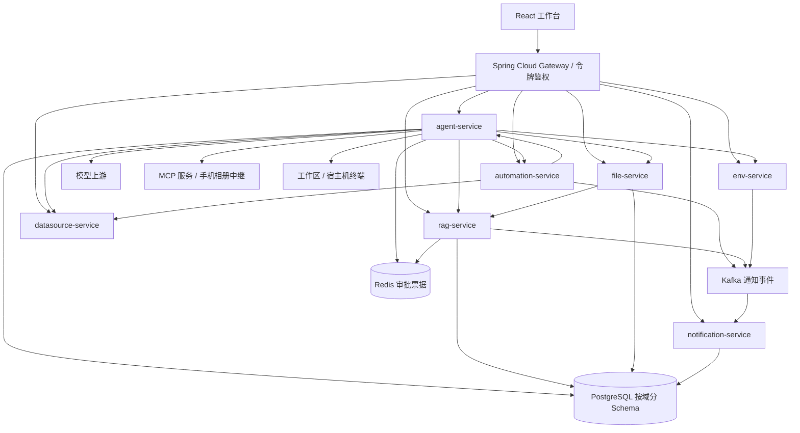

# Nora 项目分析（2026-09-19）

**总体判断：Nora 已经是能实际使用的单用户 AI 工作台，核心价值在于把对话、知识、文件、数据库、进程和手机媒体连接成可执行的工作流。当前主要短板是权限边界、失败状态真实性、长任务恢复和交付验证。下一阶段应先稳定已有闭环，再扩展功能。**

本报告基于当前本地源码、实际编译测试、运行中服务的只读检查、浏览器检查，以及隔离复现。没有修改业务代码、部署配置或真实业务数据，没有执行真实写库 SQL、调用真实模型或访问真实照片。

## 1. 范围与证据

- 主仓库：`nora-web`、`nora-api`、部署与评测脚本。
- 配套仓库：`phone-album-mcp` 是包含独立 `.git` 的嵌套仓库；检查了架构、构建配置和中继缓存鉴权路径，未执行 Android 构建或手机端完整验收。
- 主仓库跟踪的 TS/TSX/Java 文件共 363 个、54,931 行，包含测试与注释；不是有效代码行数或测试覆盖率。
- 前端：183 个源码文件、23,632 行，其中 24 个测试文件、2,054 行。
- 后端：180 个 Java 文件、31,299 行，其中 33 个测试文件、4,495 行。
- 当前会话没有可调用的 codebase-memory MCP 工具，因此无法确认图谱 generation 或执行 coverage 校验。本次回退到文件清单、定向文本搜索和源码核查；不声称完成逐行穷尽审计。
- 未检查线上服务器、防火墙、生产密钥设置或外部依赖的最新漏洞公告。以下部署风险按配置和本机事实评估，不代表已确认公网可被利用。

## 2. 产品定位与实际能力

用户可以从对话入口发出请求，让 Agent 调用工作台能力，并在界面上看到工具步骤、结果、审批和产物。文件中心、知识库、数据源、环境控制台是同一套操作能力的直接入口。这种组合有实际价值：例如“查库 → 生成报告 → 保存文件”，或者“扫描手机相册 → 查看拼图 → 选取原图”。

| 模块 | 当前实现 | 主要边界 |
|---|---|---|
| 对话 / Agent | 流式回答与推理展示、多轮工具执行、模型渠道、会话历史、审批、取消、上下文压缩、重连接续 | 并发轮次、审批时序、SSE 回放仍有缺陷 |
| 文件中心 | 上传、目录、预览、下载、回收站、恢复、永久删除、加入知识库 | 文件与知识索引跨服务一致性依靠尽力通知 |
| RAG | 文本提取、分块、embedding、pgvector 检索、pg_trgm 关键词检索、RRF 融合、引用、重建索引 | 首次索引事务处理有问题；缺少本次可验证的检索质量基准 |
| 数据源 | PostgreSQL / MySQL / Redis 连接、结构浏览、查询、历史；Agent 写操作 | SQL“只读”目前主要靠语句检查，存在绕过 |
| 环境管理 | Docker、文件日志、进程纳管、日志流、进程守护、AI 分析 | 具备宿主机执行权限，需要独立于聊天权限的系统隔离 |
| 自动任务 | 规则持久化、手动 / 每日 / 每周调度、SQL / Agent 动作、执行历史 | 文件上传 / 服务异常选项尚未接通自动触发；前端失败路径会产生虚假成功 |
| MCP / Skills | MCP 配置与工具调用、不同传输方式、技能管理、工作区记忆 | 插件、终端和工作区共同扩大了 Agent 权限范围 |
| 通知 | Kafka 发布、notification-service 消费落库、已读管理、前端轮询 | 当前是 60 秒轮询，不是文档计划中的通知 SSE；不能当可靠任务队列 |
| 手机媒体 | Android MCP 服务、WebSocket 中继、缩略图 / 拼图、媒体缓存、网络质量适配 | 嵌套仓库独立交付；中继缓存存在已复现的鉴权绕过 |

主应用有 10 个工作台页面及登录页。根 README 的“72%”“7 个服务”“通知未实现”等是 9 月 6 日的历史描述，已不能代表当前进度。不建议重新给一个未经验收矩阵支撑的完成度百分比。

## 3. 架构与数据流



**前端。** React 18、React Router 7、Vite、TypeScript、Tailwind 3、Radix、Zustand。`App.tsx` 集中注册路由，业务组件按领域划分，HTTP/SSE 契约与 store 分层。Next.js 已大体迁移完成，只保留少量兼容映射。构建实测使用 Vite 7.3.6。

**后端。** Java 21、Spring Boot 3.3.4、Spring Cloud Gateway / Nacos、JdbcTemplate、Flyway。当前 Maven reactor 是 14 个模块（含父工程），其中 8 个服务。服务间主要通过 HTTP 客户端和固定基址互调；网关通过 Nacos 发现服务。不能把 POM 中声明的 Dubbo / Sentinel 版本直接等同于已投入使用的 RPC / 熔断治理。

**Agent。** 核心路径为 AgentController → ChatTurnRunner → ChatOrchestrationService → 上下文与模型解析 → UpstreamLlmClient → ToolStepEmitter → ChatToolExecutor。当前工具循环与上游流解析由项目自身实现；LangChain4j 用于部分能力，不能把整个 Agent 描述成标准 AiServices 托管运行。

**权限。** 有两层不同概念：网关令牌控制“谁能访问工作台”；ASK / ASSIST / FULL 控制“Agent 工具何时询问”。`run_command` 实际启动宿主机进程，工作目录允许绝对路径，工作区不是操作系统沙箱。即使 FULL 仍对部分 CRITICAL 操作询问，也不意味着无法通过通用终端达到相同效果。

**部署。** 多进程微服务、共享 PostgreSQL、Nacos、Redis、Kafka，加上手机中继，运维面已经明显大于普通个人应用。部署脚本使用 systemd、Nginx 和 Docker，具备可操作的部署基础，但环境参数、脚本和文档间仍有漂移。

对当前单用户定位，不建议立即重写成单体，也不建议继续拆更多服务。优先固定服务边界和配置来源，减少跨服务失败需要人工恢复的场景。

## 4. 已确认的问题，按优先级排列

### P1：相册中继缓存绕过鉴权（隔离 HTTP 实测）

位置：[relay.mjs:267](../../phone-album-mcp/relay/relay.mjs:267)、[relay.mjs:918](../../phone-album-mcp/relay/relay.mjs:918)。

缓存键主动删除 `t` 令牌；HTTP 处理在转发手机前先查缓存，命中后直接返回。手机端鉴权不会再运行。仓库中的中继 Nginx 配置也没有为图片路径补充独立鉴权。

在临时目录复制原始 relay 源码、安装其声明的 `ws` 依赖，只绑定 loopback 并放入合成缓存数据后，结果为：

```text
RELAY no-token    200 cache HIT syntheticBody True
RELAY wrong-token 200 cache HIT syntheticBody True
```

影响是：能够访问中继的人，知道或猜到已缓存图片路径后，可能不带有效令牌直接读取缓存。此结论限于本地复现的代码路径；没有访问线上中继或真实照片。

建议：缓存读取前必须完成访问授权；令牌轮换需要有明确的失效语义。若中继不能验证手机令牌，应采用可验证的签名媒体 URL 或受控会话方案，不能只把令牌从缓存键删除后裸返回。

### P1：“只读 SQL”检查不能保证只读（隔离调用实测）

位置：[SqlGuard.java:87](../../nora-api/services/datasource-service/src/main/java/com/nora/datasource/service/SqlGuard.java:87)、[DatasourceServiceImpl.java:192](../../nora-api/services/datasource-service/src/main/java/com/nora/datasource/service/DatasourceServiceImpl.java:192)。

`EXPLAIN ANALYZE` 检查只看紧接着的首个动词；内部是 `WITH` 时无法识别 CTE 内的写操作。隔离调用真实编译类确认以下字符串被放行：

```sql
EXPLAIN ANALYZE
WITH x AS (DELETE FROM probe_only_never_executed RETURNING *)
SELECT * FROM x
```

这条 SQL 仅传给了检查函数，未发送到数据库。执行层使用普通 JDBC Connection，没有在这条路径建立数据库只读事务；连接账户拥有写权限时，该检查不足以作为安全边界。SELECT 调用有副作用函数也属于同类问题。

建议：首先使用数据库只读账户及明确的只读事务约束；语句解析作为补充。写操作应使用独立、已授权的执行路径。

### P1：自动任务可能在后端失败后显示“执行成功”（源码确认）

位置：[useAutomations.ts:59](../../nora-web/src/hooks/useAutomations.ts:59)、[useAutomations.ts:116](../../nora-web/src/hooks/useAutomations.ts:116)、[NewAutomationModal.tsx:40](../../nora-web/src/components/automations/NewAutomationModal.tsx:40)。

创建任务先加入 `Date.now()` ID 的乐观条目，请求失败后仍保留，弹窗立即提示创建成功。之后点击运行时，只有 `id < 1e12` 才会调用后端；该乐观条目会进入本地分支，生成固定“1.2s / success”的记录。因而在真实后端模式下也能出现未创建、未执行却报告成功的情况。

另外，后端返回空规则或空执行列表时，syncFromBackend 因 `length > 0` 条件不覆盖本地状态，会继续展示旧缓存。

建议：真实模式的创建与运行必须等待服务器结果；失败回滚或明确标记未保存，不能进入模拟执行分支；成功的空数组也是权威状态。

### P1（部署条件风险）：网关鉴权依赖下游端口隔离

位置：[AuthGatewayFilter.java:58](../../nora-api/services/gateway-service/src/main/java/com/nora/gateway/auth/AuthGatewayFilter.java:58)、[deploy-megumin.sh:59](../../scripts/deploy-megumin.sh:59)。

本机实测 `/api/auth/status` 返回 `authRequired:false`，8080–8087 监听地址为 `::`，直接请求 8083 的 skills 接口无需令牌得到 200。下游服务依赖网关作为鉴权入口，通用 JWT 模块的存在不代表这些路径已受保护。

本地免登录可以是有意选择；但生产若只开启网关令牌而仍允许外部直连业务端口，网关保护可以被绕开。部署脚本生成的 systemd 单元也未指定专用 `User=`。

建议：单机部署将下游服务绑定 loopback 或私有网络，使用防火墙限制访问；为有终端执行能力的服务设置明确的 OS 用户权限。当前没有核实生产网络，因此不判定线上已经暴露。

### P2：审批结果存在先完成后等待的竞态（隔离调用实测）

位置：[ApprovalService.java:106](../../nora-api/services/agent-service/src/main/java/com/nora/agent/service/ApprovalService.java:106)、[ToolStepEmitter.java:159](../../nora-api/services/agent-service/src/main/java/com/nora/agent/service/ToolStepEmitter.java:159)。

register 在 Future 完成回调中立即删除 pending；await 又通过 token 去 pending 查 Future。注册后先 resolve(true)、再 await 的实际结果是：

```text
APPROVAL resolve=true await=false
```

这意味着 UI 已批准的操作，在等待方稍晚读取时会被判为拒绝。建议等待方持有注册时的同一个 Future，消费结束后再清理；不要依赖可先被删除的 Map 条目。

### P2：SSE 接续同时存在游标协议不一致和缓存截断

位置：[TurnStreamController.java:96](../../nora-api/services/agent-service/src/main/java/com/nora/agent/controller/TurnStreamController.java:96)、[TurnStreamController.java:143](../../nora-api/services/agent-service/src/main/java/com/nora/agent/controller/TurnStreamController.java:143)、[TurnStreamRegistry.java:56](../../nora-api/services/agent-service/src/main/java/com/nora/agent/service/TurnStreamRegistry.java:56)。

- 源码确认：解析 Last-Event-ID 要求 `turnId:seq`，实际发送的事件 id 却只有 `seq`。浏览器自动重连传回的数字无法通过解析，游标退回 0，可能重复回放并追加文本。
- 隔离复现：append 8,002 条事件后，lastSeq 为 8,002，但 snapshotAfter(8000) 返回 0 条。达到 8,000 上限后停止记录新事件，仍继续给在线连接推送；掉线期间的新内容无法回放。

建议：统一发送与接收的事件 ID；定义有界缓存的缺口协议，检测到断档时让前端从权威消息状态恢复。不要仅扩大数组上限。

### P2：同一会话缺少服务端并发轮次保护（源码确认）

位置：[AgentController.java:127](../../nora-api/services/agent-service/src/main/java/com/nora/agent/controller/AgentController.java:127)、[TurnStreamRegistry.java:124](../../nora-api/services/agent-service/src/main/java/com/nora/agent/service/TurnStreamRegistry.java:124)。

发送入口使用 activeTurns.put 覆盖句柄；实时流也按 sessionId 覆盖，取消标志在新轮次开始时重置。两个标签页或重复请求并发发送时，旧轮次没有被拒绝或明确终止，会发生两轮同时执行，而取消只控制其中一个句柄的问题。

建议：用原子占位保证每会话单轮运行，重复提交返回冲突；轮次 ID 同时进入取消、流和持久化语义。没有在真实模型上制造并发调用。

### P2：首次索引失败状态会随事务回滚（源码确认）

位置：[IndexingService.java:68](../../nora-api/services/rag-service/src/main/java/com/nora/rag/service/IndexingService.java:68)、[IndexingService.java:106](../../nora-api/services/rag-service/src/main/java/com/nora/rag/service/IndexingService.java:106)。

indexDocument 的整个方法带 @Transactional，在事务里调用外部 embedding；异常时 markFailed 使用默认 TransactionTemplate，随后重抛 RuntimeException。失败标记没有独立于外层事务提交，新 processing 行及 failed 更新会一起回滚。长时间 embedding 还会占用事务连接。

reindexChunks 已采用事务外 embedding + 短事务写入，但首次索引尚未一致。建议统一阶段：持久化任务状态、事务外嵌入、短事务提交结果、独立持久化失败；避免简单换成 REQUIRES_NEW 后仍更新尚未提交的新文档行。

### P2：文件生命周期同步失败后缺少自动补偿（源码确认）

位置：[RagIndexClient.java:69](../../nora-api/services/file-service/src/main/java/com/nora/file/client/RagIndexClient.java:69)。

文件删除 / 恢复 / 永久删除的 RAG 通知是 @Async HTTP，失败只记日志。已有索引完成时复查文件的补偿，但无法覆盖“文档早已索引，删除时 RAG 不可用，随后 RAG 恢复”这一场景，旧文档仍可能进入检索。

建议：先做持久化待处理通知及有限重试 / 定期对账，不必立即引入完整分布式事务；删除语义和用户可见状态应保持一致。

### P2：开启登录后部分媒体入口遗漏令牌（源码确认）

位置：[mediaCacheApi.ts:59](../../nora-web/src/lib/services/mediaCacheApi.ts:59)、[MediaCacheBrowser.tsx:154](../../nora-web/src/components/files/MediaCacheBrowser.tsx:154)、[FileViewerModal.tsx:59](../../nora-web/src/components/files/viewer/FileViewerModal.tsx:59)。

缓存浏览器的 img / video 使用 previewUrl 生成的裸 `/api/media/cache`，原文件打开路径也直接 window.open 裸 raw URL。它们无法携带 Bearer header，又没有添加 token。启用网关令牌后会被 401 拦截；其他媒体路径已有 withAuthToken，可统一复用。

本机鉴权关闭，未改变配置制造故障。此项为条件明确的源码结论。

### P2：自动任务 UI 提供尚未接通的触发条件

位置：[NewAutomationModal.tsx:11](../../nora-web/src/components/automations/NewAutomationModal.tsx:11)、[AutomationService.java:170](../../nora-api/services/automation-service/src/main/java/com/nora/automation/service/AutomationService.java:170)。

浏览器实见“文件上传时”和“服务异常时”；后端 create 也接受 file / error，但当前调度只扫描 daily / weekly。在 automation 服务实现及调用方中未找到这些事件驱动的执行接线。用户可以保存出看似有效但不会因相应事件自动运行的规则。

建议：先将未实现选项标为不可选，或接通真实事件后再开放。每日 / 每周目前是日期窗口扫描，也没有用户可配置的具体时间 / 时区 / 错过执行策略，产品文案应准确表达当前能力。

## 5. 工程质量与性能

**可取之处。** 按业务域组织代码、统一错误信封与 traceId、数据库迁移、软删除、模型渠道契约、工具审批和执行时间线，都有实质实现。RAG 的混合召回与来源引用，以及 Agent 的上下文预算、取消和重连方向，也符合实际长期使用需求。

**复杂度集中。** ChatToolExecutor 1,824 行、AgentWorkspaceService 1,063 行、ChatOrchestrationService 1,033 行；前端 files/page.tsx 689 行、ChatInputArea 614 行、useChat 526 行。行数本身不是缺陷，但这些文件已同时承载多个变化原因，超过仓库对页面胶水层的约定。建议围绕文件、媒体、MCP、任务这些现有领域逐步收敛职责；不要为了缩短文件添加通用框架。

**前端包体。** 构建主 JS 为 814.49 KB，gzip 240.31 KB；项目维护规范目标为 gzip ≤180 KB，当前超出约 33.5%。App.tsx 静态导入所有页面，大量“动态导入与静态导入并存”的构建警告说明分块意图未真正生效。先做路由级懒加载，再测量重型文件预览与媒体组件的分块效果。

**Lint。** ImageLightbox.tsx:461 在 render 中读取 dragging.current，触发 react-hooks/refs 错误。当前 lint 门禁不是全绿。

**存储与规模。** 文件列表、会话历史等路径仍有全量读取；部分文件上传 / raw 操作会把文件整体放入内存。个人少量数据阶段可以接受，但相册导入和长对话会推动数据快速增长，应先建立实际文件数、消息数、内存和耗时基线，再决定分页、流式读取和虚拟列表范围。

**架构局限。** LiveTurn、activeTurns、自动任务防重集合都在进程内。Redis 审批票据并不意味着整个 Agent 已具备多实例恢复能力。当前系统应明确按单用户、单 Agent 实例运行。

**文档漂移。** 根 README、后端 README、前端 AGENTS 和维护技能对 Mock 开关、通知、设置、兼容层、服务数量的描述不一致。相册 README 声称中继不存照片，但实际 relay 有磁盘缓存。这些差异会误导后续开发和隐私判断，应该优先同步“当前行为”，历史进度保留日期即可。

## 6. 实际验证结果

| 检查 | 结果 | 能证明什么 |
|---|---|---|
| pnpm typecheck | 通过 | 当前前端类型检查通过 |
| pnpm lint | 失败，1 个错误 | ImageLightbox render 中访问 ref |
| pnpm test | 24 文件、126 测试通过 | 现有前端测试执行成功 |
| pnpm build | 通过，有包体 / 分块警告 | 可构建生产静态产物 |
| mvn -B test | 14 模块成功，33 套件、264 测试通过 | 现有后端测试执行成功 |
| 本机服务只读检查 | 8081–8087 actuator UP；网关 chat health 200 | 检查时服务在线，不等于业务端到端正确 |
| 浏览器检查 | 首页、自动任务、任务触发下拉、知识库正常渲染 | 真实页面可打开并显示后端数据 |
| ApprovalService 隔离检查 | resolve=true / await=false | 确认审批时序缺陷 |
| TurnStreamRegistry 隔离检查 | lastSeq=8002 / replayAfter8000=0 | 确认回放缓存截断 |
| SqlGuard 隔离检查 | 写 CTE 的 EXPLAIN ANALYZE 被接受 | 确认守卫放行，不曾执行该 SQL |
| relay 临时副本 HTTP 检查 | 无令牌 / 错令牌均 200 HIT | 确认合成缓存内容绕过鉴权 |

仓库约定单测只作冒烟，所以测试通过不应被表述成行为正确性的充分证据。已有 E2E 和工具选择评测脚本值得保留，但尚不足以支撑全功能验收：例如 tool-eval.sh 忽略 curl 失败，并把“未观察到工具调用”当作负例成功条件，空流 / 请求失败也可能通过该类用例。

建议继续遵守现有单测约定，把结果断言放在真实服务 E2E：先检查 HTTP/SSE 正常结束，再校验业务状态、实际副作用及失败时状态。此次未运行会产生真实模型费用或业务副作用的全套脚本。主仓库跟踪文件中未见统一 CI 工作流定义；不排除仓库外部有流水线。

## 7. 推荐推进顺序

1. **先修权限与结果真实性。** 修中继缓存鉴权、只读 SQL 边界、自动任务假成功；确认下游服务和宿主机权限隔离。对应验收必须覆盖无令牌、错误令牌、后端失败和无副作用场景。
2. **再修长任务与状态一致性。** 修审批竞态、SSE 游标与回放缺口、单会话并发；统一索引事务阶段，补文件生命周期同步重试。
3. **让功能承诺与实现一致。** 修登录后媒体入口；明确自动任务支持的触发方式；更新 README / AGENTS / 运维说明。
4. **恢复并落实工程门禁。** 修 lint，路由分块，把已有测试与真实服务 E2E 接入可重复的交付检查；演练数据库、文件及工作区的备份恢复。
5. **最后做结构整理。** 按现有领域拆解大型执行器和文件页面；依据实际数据量决定分页、缓存、并发限额，避免先追加分布式架构。

适合当前项目的发布标准是：请求有真实结果、失败能被看见、取消确实停止、断线能恢复、危险动作的权限边界明确。满足这些条件后，已有功能组合就足以形成一个稳定且有特色的个人工作台。
